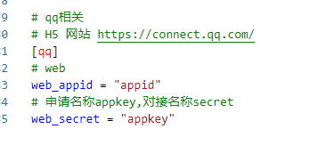
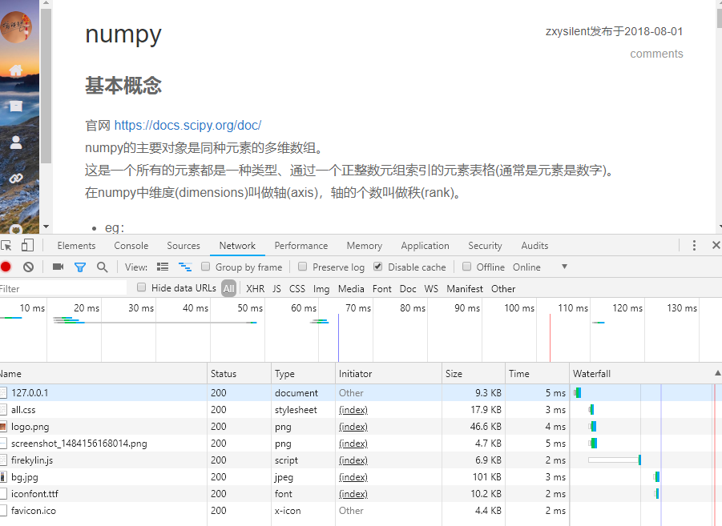
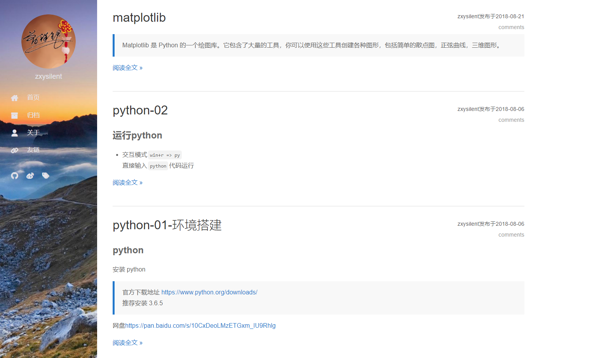
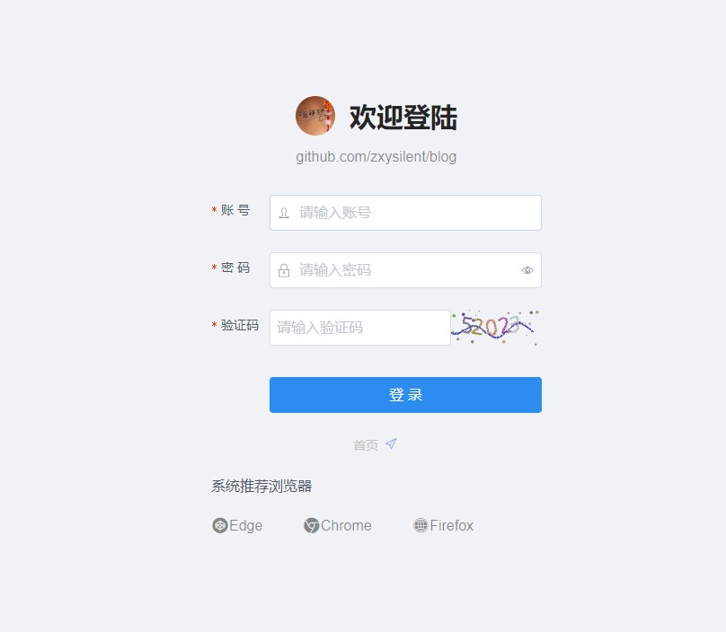
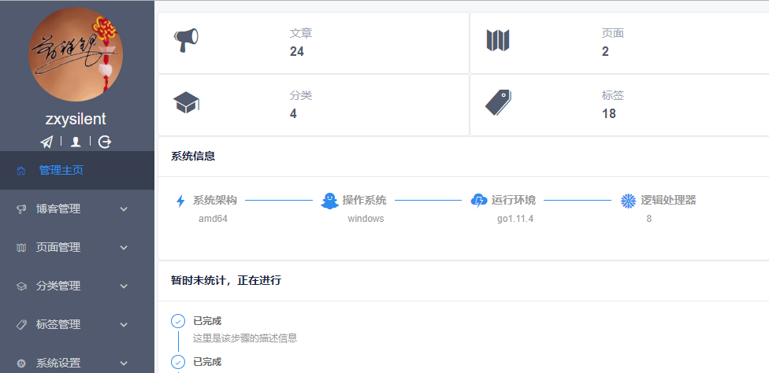
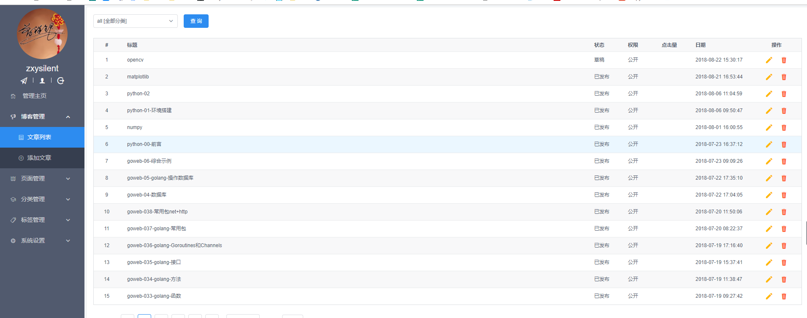
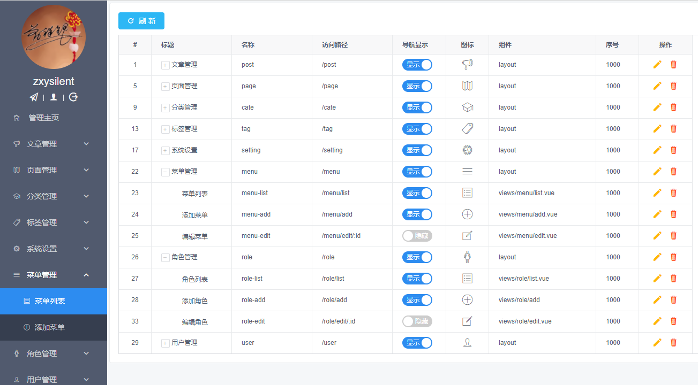
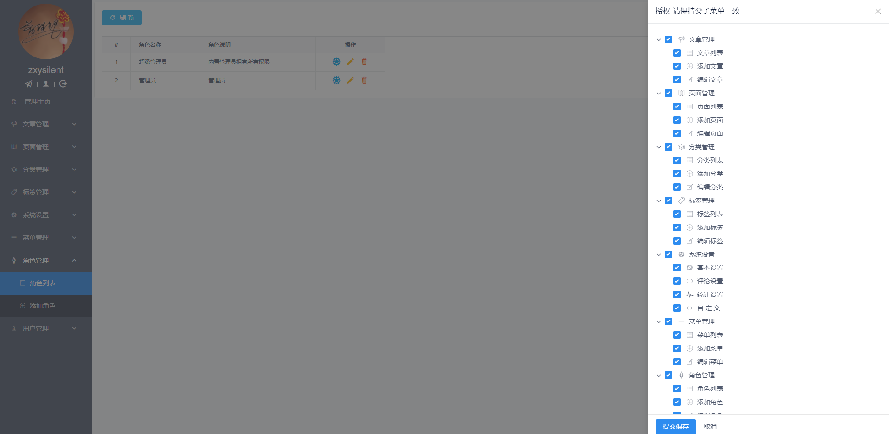

## go_web

本项目源自[blog](https://github.com/zxysilent/blog) \
目前主要功能为个人博客服务。\

### TODO
- [ ] 增加个人简历功能，markdown编辑，输出pdf
- [ ] 集成小游戏：[吃掉小鹿乃](https://github.com/arcxingye/EatKano) 集成到vue项目

### 目录结构
```tree
卷 仓储 的文件夹 PATH 列表
卷序列号为 DE26-25AF
E:.
_________
├─conf
├─control
│  ├─appctl
│  └─sysctl
├─data
│  └─imgs
├─dist  // 后台项目编译后文件夹
├─docs
├─internal
│  ├─fetch
│  ├─page
│  ├─rate
│  ├─token
│  └─vcode
├─logs 
├─model  // sql模块
├─router  // 路由
├─static   // 前端静态文件
├─views // 博客前端显示模板
└─vue // vue源码——后台管理项目
```

### 技术栈
- golang [https://golang.google.cn](https://golang.google.cn)
- vue [https://cn.vuejs.org](https://cn.vuejs.org)
- xorm [https://xorm.io](https://xorm.io)
- echo [https://echo.labstack.com](https://echo.labstack.com)
- iview [https://www.iviewui.com](https://www.iviewui.com)
- UI 修改于 [https://firekylin.org](https://firekylin.org)
  
实现```blog```功能,方便二次开发
- [x] 文章管理
- [x] 页面管理
- [x] 分类管理
- [x] 标签管理
- [x] 系统设置
- [x] 管理主页
- [x] QQ扫码登录

## 说明

- 替换markdown 编辑器为富文本编辑器即可作为简单`CMS`,更多功能请二次开发
  [https://github.com/zxysilent/view-design-admin](https://github.com/zxysilent/view-design-admin)

- 富文本预览地址  
  [http://qn.static.zxysilent.com/demos/view-design-admin/index.html#/pages/editor](http://qn.static.zxysilent.com/demos/view-design-admin/index.html#/pages/editor)

- QQ扫码登录
    - 申请应用 [https://connect.qq.com](https://connect.qq.com)
    - 配置`conf/conf.toml`下面`[qq]`的`web_appid`和`web_secret`
      
    - 配置数据库中 `user`表的`openid_qq`
    - 修改 `control/sysctl/auth_qq.go`中 `redirectUrl`重定向地址，要保证和申请应用中填写的一致(生成方式见`control/sysctl/sysctl_test.go`中 `TestURLEncode`)

## 使用方式-直接部署
```
git clone -b v0.4.0 --depth=1 https://github.com/zxysilent/blog.git
```
若要部署，请修改关键信息[token、用户名、密码等]
数据库自带文章内容请在部署前删除

### 部署界面
- 安装依赖```npm install```
- 修改```.env.development```中的```VUE_APP_SRV```为自己的服务地址
- 发布```npm run build```会自动发布到```dist```目录下面
- 友链里面第一个为后台登陆地址默认用户名```zxysilent```,密码```zxyslt```，可自行数据库修改
### 部署服务
- 配置```conf.toml```数据库信息
- 还原```data```目录下```db.sql```数据库
  数据库自带文章内容请在部署前删除
- 安装依赖```go mod tidy```
- 编译可执行程序
    - 普通开发编译版本```go build```
    - 编译不带日志和swagger文档版本```go build -tags=prod```体积大幅度减小,日志请用```nginx、caddy```等```web```服务器记录
    - 若需要日志且不需要文档，请自定义开发或提issues
- 服务器部署
    - windows 直接运行
    - linux 普通方式```nohup ./blog>>nohup.log 2>&1 &```

### 评论配置
- 配置项目 sys_global(表).comment(值)
- 配置说明 [https://github.com/gitalk/gitalk](https://github.com/gitalk/gitalk)

## 使用方式-自定义开发
```
git clone https://github.com/zxysilent/blog.git
```
若要部署，请修改关键信息[token、用户名、密码等]
数据库自带文章内容请在部署前删除

### 开发界面
- 安装依赖```npm install```
- 开发运行```npm run serve```
- 浏览器打开 [http://127.0.0.1:8080/](http://127.0.0.1:8080/)
- 友链里面第一个为后台登陆地址默认用户名```zxysilent```,密码```zxyslt```，可自行数据库修改
###  开发服务
- 配置```conf.toml```数据库信息
- 还原```data```目录下```db.dev.sql```数据库
  数据库自带文章内容请在部署前删除
- 安装依赖```go mod tidy```
- 安装 swag
    - ```go get -u github.com/swaggo/swag/cmd/swag```
- 运行```swag init```生成api文档
- 运行后台```go run```
- 浏览器默认访问 [http://127.0.0.1:8085/](http://127.0.0.1:8085/)

## 渲染性能


## 效果展示

### 前台
- 首页
  
- 归档
  
- 关于
  

### 后台
- 登录
  
- 首页
  
- 文章
  
- 文章编辑
  
- 配置
  
- 菜单
  
- 角色
  
## Donation
If this project help you a lot, you can support us by:

AliPay


Wechat Pay

